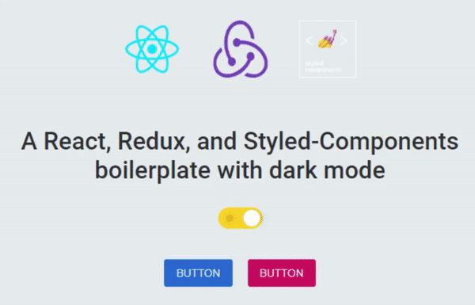

A React, Redux, and Styled-Components boilerplate with dark mode implementation

## Get Started

### `npm i`

Installs dependencies 

### `npm start`

Runs the app in the development mode. 
Open [http://localhost:3000](http://localhost:3000) to view it in the browser.
